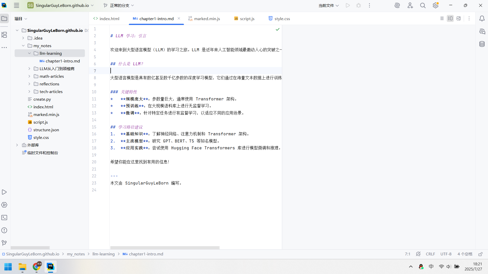

# LLM 学习：引言

欢迎来到大型语言模型（LLM）的学习之旅。LLM 是近年来人工智能领域最激动人心的突破之一，它们能够理解、生成和处理人类语言。

## 什么是 LLM？

大型语言模型是具有数亿甚至数千亿参数的深度学习模型，它们通过在海量文本数据上进行训练来学习语言的模式和结构。

### 关键特性
*   **规模庞大**：参数量巨大，通常使用 Transformer 架构。
*   **预训练**：在大规模语料库上进行无监督学习。
*   **微调**：针对特定任务进行有监督学习，以适应不同的应用场景。

## 学习路径建议
1.  **基础知识**：了解神经网络、注意力机制和 Transformer 架构。
2.  **主流模型**：研究 GPT、BERT、T5 等知名模型。
3.  **应用实践**：尝试使用 Hugging Face Transformers 库进行模型微调和推理。

希望你能在这里找到有用的信息！

---
本文由 SingularGuyLeBorn 编写。

        